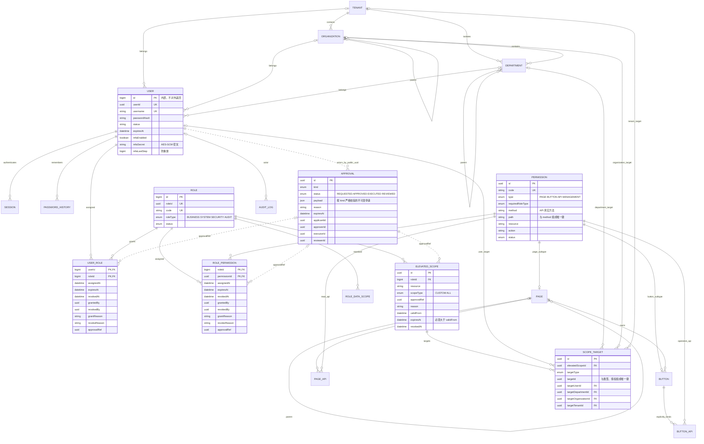

# 权限体系设计与表结构关系图

本设计对应 REQUIREMENTS.md，采用显式 RBAC、资源状态检查、职责互斥、受控审批和服务端数据范围。`schema.prisma` 为字段定义来源，迁移中的 CHECK、审计保护触发器补充 Prisma 不表达的约束。要求 MySQL 8.0.16 及以上；开发执行命令前必须 `nvm use`。

## 表结构关系图

实线表示数据库外键；虚线为保留历史身份的公开 UUID 引用，由事务内服务验证。图中 PAGE、BUTTON、PAGE_API 分别对应 `sys_function`、`sys_function_button`、`sys_function_api`。ELEVATED_SCOPE、SCOPE_TARGET 对应 `sys_role_elevated_data_scope`、`sys_role_elevated_data_scope_target`。同一个授权对象可以被撤销、续期，但每次变更前后完整快照必须保存在不可更新的审计记录中。

## 权限判定

每个业务/管理路由必须声明 `RequirePermissions`；缺少声明时拒绝。健康、登录、验证码及本人账户操作使用守卫中的封闭例外目录，本人操作仍由 AuthGuard 和服务内所有权校验保护。

1. 从服务端会话加载用户状态、账户期限、会话吊销、绝对/闲置期限。
2. 加载启用角色和未撤销、未过期的角色/权限授权。每次请求重新计算，权限数据库不可用则拒绝；不依赖可过期的允许缓存。
3. 校验角色职责和资源的 `requiredRoleType`，拒绝互斥管理员职责。共享审批查询只有服务端固定的显式例外，服务还独立限制 SECURITY/AUDIT。
4. 校验页面祖先均有效且已明确授权；按钮还需要所属页面有效且已授权。
5. API 需要独立显式授权。若存在页面或按钮绑定，至少有一条有效且已授权的访问路径。绑定本身不生成 API 或按钮授权。
6. 将请求方法和 Fastify 已匹配的路由模板与授权 API 精确比较，忽略原始 URL 中查询参数；不使用客户端提交的路径作为判定依据。
7. 管理员要求 MFA；高危操作同时要求五分钟内的 MFA 和重新认证。
8. 业务仓储通过 `DataScopeService.execute` 在同一事务中生成并执行 `AND(租户边界, 各有效范围, 请求筛选)`。所有范围取交集；SELF 使用当前公开 userId，组织树来自主数据。ALL 也不能突破当前租户。

## 职责与审批

| 职责 | 允许领域 | 与其互斥的管理职责 |
| --- | --- | --- |
| BUSINESS | 明确配置的业务资源 | 不得通过普通授权获得管理资源 |
| SYSTEM | 受控运行维护 | SECURITY、AUDIT |
| SECURITY | 账户、权限、审批执行 | SYSTEM、AUDIT |
| AUDIT | 审计查询、审批复核 | SYSTEM、SECURITY |

通配 `*`、`ALL` HTTP 方法及历史 `system.permission.manage` 不参与授权。角色类型不能通过普通角色创建/编辑请求修改。内置职责通过离线初始化维护，日常高危角色绑定和权限授予/回收走审批；不提供无期限超级管理员能力。

新密码采用 scrypt `N=131072, r=8, p=1` 与独立随机盐；旧 `N=16384` 哈希仅为存量验证保留，密码修改后使用新成本。口令长度 12–128 字符，支持复杂密码或长口令短语，阻止当前及最近五次历史重复，本人修改最短间隔 24 小时。MFA 使用带防重放计数的 TOTP，密钥以 AES-256-GCM 加密并绑定账户；并发会话默认最多三个。算法参数参考 [OWASP Password Storage](https://cheatsheetseries.owasp.org/cheatsheets/Password_Storage_Cheat_Sheet.html)。

审批链：申请 → 独立安全管理员审批 → 安全管理员执行 → 独立审计管理员复核。申请人不能审批；复核人与前三阶段参与者不同；所有阶段不得为自己授予、回收、重置 MFA 或复核权限。MFA_RESET 用于管理员认证器丢失等恢复场景，要求显式 `system.user.mfa-reset` 能力，执行时清空目标用户 MFA 密钥/计数并吊销其现有会话，目标用户需重新登录并绑定认证器。申请有效期最长 24 小时。到期后禁止执行，允许事后复核。状态认领、实际变更与审计处于 Serializable 事务，重复执行返回冲突。

## 前后端接入

| 页面 | 对应接口 | 控制 |
| --- | --- | --- |
| `/system/permission` | `/permission/functions`、`/permission/buttons` | 页面树、根/子页面、编辑、启停、只读 API、按钮操作 API |
| `/system/permission/api` | `/permission/apis`、`/permission/api-options` | 分页筛选、创建、编辑、启停、引用关系、无引用删除 |
| `/system/role` | `/roles`、`/roles/:id/grants` | 页面/按钮/API 独立选取、原因、有效期、变更影响 |
| 角色的数据范围弹窗 | `/permission/roles/:roleId/data-scopes` | 普通范围新增/撤销，CUSTOM/ALL 进入审批 |
| `/system/permission/approval` | `/permission/approvals` | 四阶段审批、受控授予/回收、MFA 重置、详情与操作者 |
| `/system/session` | `/auth/mfa/*`、`/auth/reauth` | 认证器绑定、重新认证、本人会话管理 |
| `/system/audit` | `/audit-logs` | 审计检索及变更前后值，不提供普通更新/删除 |

完整的 API 方法、路由和职责目录位于 `security/permission-catalog.ts`。审批请求结构见 `approval.contract.md`。GET 200、POST 创建 201、PATCH 200；接口资源删除返回 204。错误通过 Problem Details 返回，不暴露 Prisma/SQL 内部错误。

## 安全迁移与部署

1. 备份原库并在隔离库验证恢复；检查路由及 `(method,path)` 重复记录。DDL 不承诺事务回滚，失败时按已执行语句恢复。
2. 执行 `backend/prisma/permission-preflight.sql`，解决重复路由、重复方法/路径与旧新权限码冲突后再迁移。
3. 执行 `nvm use`，再执行 `pnpm --filter backend db:generate`、`pnpm --filter backend db:deploy`。迁移会吊销旧会话、撤销旧授权并禁用通配权限，必须安排维护窗口。
4. 通过秘密管理配置 MFA_ENCRYPTION_KEY（32 字节随机密钥的 Base64）、Redis、HTTPS/Cookie 和独立管理员账户。可用 `openssl rand -base64 32` 生成该密钥。密钥必须长期保存并在所有后端实例保持一致，不能在每次发布或容器重启时重新生成；更换或丢失后，已绑定的管理员 MFA 密文无法解密，需要通过 MFA_RESET 审批或受控离线流程重置。未配置或格式错误时，应用可能仍可启动，普通非管理员能力也可能可用，但管理员首次绑定、登录验证码校验、重新认证和审批等后台能力会失败，因此生产部署视为不可用配置。`.env.example` 列出了安全审批人、审计管理员和运维管理员的初始化变量。
5. `pnpm --filter backend db:seed` 维护服务器权限目录及独立角色，不覆盖已有密码、不自动重新启用已禁用资源。首次登录只允许 MFA 绑定及必要本人操作；如果 MFA_ENCRYPTION_KEY 或 Redis 不可用，管理员无法完成首次绑定，后续权限、角色、审批和审计管理接口会被守卫拒绝。旧普通角色的权限需重新审核后显式授权。
6. 应用数据库账户只授予必要 SELECT/INSERT/UPDATE 权限，不授予 DDL、TRIGGER 或对审计表 UPDATE/DELETE；迁移账户单独管理。审计表触发器阻止正常路径的修改/删除，审计保留至少六个月的归档、签名/完整性校验与备份恢复由专用审计存储落实。

迁移删除旧页面与写接口的错误绑定前会写入审计快照；页面本身、用户、角色和业务记录不被删除。开发验证脚本只创建并删除它自己的随机本地 MySQL 测试库，不迁移现有库。

## 验收与部署边界

代码验证包括职责分离、精确路由、页面/按钮状态传播、MFA 重放、审批并发状态、租户隔离、范围交集、事务回滚、引用保护、前端序列化与选择器。实际数据库验证运行 `pnpm --filter backend exec node scripts/verify-permission-migration.mjs`（先构建）。测试报告见 `VERIFICATION.md`。

目前仓库没有业务数据的后端仓储，数据范围服务已实现；后续业务模块必须调用受控数据访问入口，不能直接使用不带范围的 Prisma 查询。组织主数据通过受保护的部署/主数据流程导入，不接受普通客户端随意构造组织归属。

等保定级、外部集中审计、可信时间同步、告警接收方、备份恢复演练、员工身份唯一性、定期权限复核制度和密钥托管需要部署环境及管理制度提供证据。代码完成不等于通过等保测评，也不声称存在“绝对安全”。授权原则参考 [OWASP Authorization Cheat Sheet](https://cheatsheetseries.owasp.org/cheatsheets/Authorization_Cheat_Sheet.html)。
